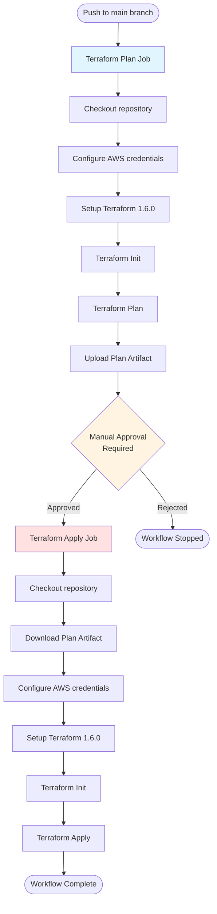

# GitHub Workflow Chart - Terraform CI/CD

This document explains the GitHub Actions workflow defined in `.github/workflows/terraform.yml`.

## Workflow Overview

The workflow implements a two-stage Terraform CI/CD pipeline:
1. **Plan Stage**: Validates and creates an execution plan
2. **Apply Stage**: Applies the infrastructure changes (with manual approval)

## Workflow Triggers

```yaml
on:
  push:
    branches:
      - main
```

The workflow triggers automatically on any push to the `main` branch.

## Permissions

```yaml
permissions:
  id-token: write
  contents: read
```

- **id-token: write** - Allows the workflow to request OIDC tokens for AWS authentication
- **contents: read** - Grants read access to repository contents

## Workflow Flow Diagram



## Job 1: terraform-plan

**Purpose**: Create and validate a Terraform execution plan

**Runs On**: `ubuntu-latest`

**Dependencies**: None (runs immediately on trigger)

### Steps

| Step | Action | Description |
|------|--------|-------------|
| 1 | Checkout repository | Uses `actions/checkout@v4` to clone the repository code |
| 2 | Configure AWS credentials | Uses `aws-actions/configure-aws-credentials@v4` with secrets `AWS_ACCESS_KEY_ID` and `AWS_SECRET_ACCESS_KEY` for region `us-east-1` |
| 3 | Setup Terraform | Installs Terraform version `1.6.0` using `hashicorp/setup-terraform@v2` |
| 4 | Terraform Init | Initializes the Terraform working directory, downloads providers and modules |
| 5 | Terraform Plan | Creates an execution plan and saves it to file `tfplan` |
| 6 | Upload Terraform Plan Artifact | Uploads the `tfplan` file as a workflow artifact named `terraform-plan` for use by the apply job |

### Key Points

- Creates a reusable, immutable execution plan
- Validates Terraform syntax and configuration
- Checks AWS resource accessibility
- Plan artifact ensures consistency between plan and apply stages

## Job 2: terraform-apply

**Purpose**: Apply the Terraform plan to provision/update infrastructure

**Runs On**: `ubuntu-latest`

**Dependencies**: `terraform-plan` (must complete successfully first)

**Environment**: `production` (enables manual approval gate)

### Steps

| Step | Action | Description |
|------|--------|-------------|
| 1 | Checkout repository | Uses `actions/checkout@v4` to clone the repository code |
| 2 | Download Terraform Plan Artifact | Retrieves the `tfplan` file created by the plan job |
| 3 | Configure AWS credentials | Uses `aws-actions/configure-aws-credentials@v4` with secrets `AWS_ACCESS_KEY_ID` and `AWS_SECRET_ACCESS_KEY` for region `us-east-1` |
| 4 | Setup Terraform | Installs Terraform version `1.6.0` using `hashicorp/setup-terraform@v2` |
| 5 | Terraform Init | Re-initializes the Terraform working directory (required after checkout) |
| 6 | Terraform Apply | Applies the downloaded plan with `-auto-approve` flag (manual approval handled at environment level) |

### Key Points

- Requires successful completion of `terraform-plan` job
- Uses `production` environment for manual approval gate
- Downloads the exact same plan that was validated in the plan stage
- Environment protection rules should be configured in GitHub settings

## Workflow Execution Flow

```
┌─────────────────────────────────────────────────────────┐
│ 1. Developer pushes code to main branch                │
└────────────────────┬────────────────────────────────────┘
                     │
                     ▼
┌─────────────────────────────────────────────────────────┐
│ 2. GitHub Actions workflow triggered                    │
└────────────────────┬────────────────────────────────────┘
                     │
                     ▼
┌─────────────────────────────────────────────────────────┐
│ 3. terraform-plan job starts                            │
│    - Checks out code                                    │
│    - Authenticates with AWS                             │
│    - Runs terraform init & plan                         │
│    - Uploads plan artifact                              │
└────────────────────┬────────────────────────────────────┘
                     │
                     ▼
┌─────────────────────────────────────────────────────────┐
│ 4. Manual approval required (production environment)    │
│    - Reviewers examine plan output                      │
│    - Approve or reject deployment                       │
└────────────────────┬────────────────────────────────────┘
                     │
                     ▼
┌─────────────────────────────────────────────────────────┐
│ 5. terraform-apply job starts (if approved)             │
│    - Checks out code                                    │
│    - Downloads plan artifact                            │
│    - Authenticates with AWS                             │
│    - Runs terraform init & apply                        │
└────────────────────┬────────────────────────────────────┘
                     │
                     ▼
┌─────────────────────────────────────────────────────────┐
│ 6. Infrastructure changes applied to AWS                │
└─────────────────────────────────────────────────────────┘
```

## Required GitHub Secrets

The workflow requires the following secrets to be configured in repository or organization settings:

| Secret Name | Purpose |
|-------------|---------|
| `AWS_ACCESS_KEY_ID` | AWS access key for authentication |
| `AWS_SECRET_ACCESS_KEY` | AWS secret key for authentication |

## Environment Configuration

The `production` environment should be configured in GitHub with:
- **Protection rules**: Require manual approval from designated reviewers
- **Reviewers**: Add team members who should approve infrastructure changes
- **Wait timer** (optional): Add delay before deployment

## Security Considerations

1. **Least Privilege**: AWS credentials should have minimal permissions required
2. **Secret Protection**: Never log or expose AWS credentials or Terraform sensitive outputs
3. **Manual Approval**: Production environment prevents automatic infrastructure changes
4. **Plan Validation**: Review plan output before approving apply
5. **State Management**: Ensure Terraform state is properly secured (remote backend recommended)

## Best Practices

- ✅ Always review the plan output before approving apply
- ✅ Use separate AWS credentials for plan and apply if possible
- ✅ Configure branch protection rules on main branch
- ✅ Store Terraform state remotely (S3 + DynamoDB)
- ✅ Use workspace isolation for multiple environments
- ✅ Add notifications for workflow failures
- ✅ Regularly update GitHub Actions and Terraform versions

## Troubleshooting

### Common Issues

**Plan Fails:**
- Check AWS credentials are valid and have required permissions
- Verify Terraform syntax is correct (`terraform validate`)
- Check provider version compatibility

**Apply Fails:**
- Ensure plan artifact was successfully uploaded
- Verify AWS credentials have apply permissions
- Check for resource conflicts or state drift

**Manual Approval Not Working:**
- Verify production environment is configured
- Check reviewer permissions
- Ensure required reviewers are available

## Related Files

- `.github/workflows/terraform.yml` - The actual workflow definition
- `main.tf` - Main Terraform configuration
- `provider.tf` - Terraform provider configuration
- `variables.tf` - Input variables
- `output.tf` - Output definitions
- `README.md` - Project documentation
